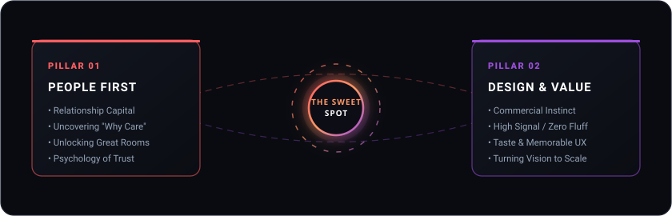
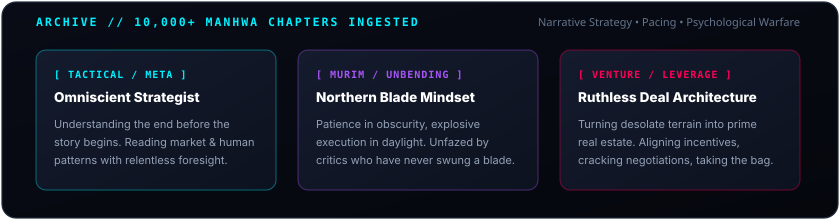

<!-- Hero Banner Animation -->

  

<!-- Quick Links & Presence Badges -->

&nbsp;

&nbsp;

  

 

<!-- Manhwa System Status Window -->

  

 

---

## ✦ The Thesis: High Taste, Ruthless Logic, Sovereign Presence

> *"Consensus builds average products. Great ventures and undeniable truths are forged exclusively in the crucible of fierce debate and relentless criticism."*

I operate at the convergence of **human psychology, product aesthetics, and high-stakes commercial instincts**. 

While others hide behind superficial tech buzzwords or shy away from pushback, I treat **criticism as free compute**. A harsh critique isn't an attack—it's an invitation to stress-test conviction, strip away fluff, and retaliate with irrefutable clarity.

 

<!-- The Dialectic Arena & Retaliation Animation -->

  

 

---

## ⚔️ The Debate Floor: Why I Welcome Criticism & Retaliate

Most people want polite head-nodding. I want intellectual combat. 

- **Criticism as Fuel**: If an idea cannot withstand aggressive skepticism, it has no business surviving in the market. Harsh scrutiny filters out vanity features and exposes core value.
- **The Surgical Counter**: If you bring a critique backed by data, logic, and insight, I’ll embrace it. If you bring shallow platitudes or unexamined assumptions, expect an immediate, razor-sharp retaliation.
- **Zero Emotional Bleed**: Ideas are meant to be dissected on the operating table. Strip the ego, sharpen the thesis, and let the best logic win.

 

<!-- Synergy & Trifecta Animation -->

  

 

---

## ⚡ What I Bring to the Table

<table>
  <tr>
    <td width="50%" valign="top">
      <h3>🤝 01. Relationship Capital &amp; Access</h3>
      
Building high-trust alliances and getting into rooms where needle-moving decisions happen. Connecting founders, operators, and capital with magnetic momentum.

    </td>
    <td width="50%" valign="top">
      <h3>🎨 02. Product Taste &amp; Brand Aura</h3>
      
Code can be replicated; taste, emotional tension, and unforgettable experiences cannot. Obsessing over typography, micro-details, and seamless narrative friction.

    </td>
  </tr>
  <tr>
    <td width="50%" valign="top">
      <h3>📈 03. Commercial Instinct &amp; Deal Flow</h3>
      
Cutting through noise to locate real market pull. Dissecting pricing power, distribution hooks, and structuring ventures designed to dominate, not merely participate.

    </td>
    <td width="50%" valign="top">
      <h3>⚔️ 04. Dialectic Sparring &amp; Clarity</h3>
      
Stress-testing pitches, product roadmaps, and business models under intense debate. Eliminating weak assumptions before they cost capital and runway.

    </td>
  </tr>
</table>

 

<!-- Manhwa Vault Animation -->

  

 

---

## 📖 The Reader's Edge: 10,000+ Chapters of Narrative & Pacing

Reading thousands of manhwas isn't just a passion—it's a masterclass in **psychology, pacing, and leverage**:

- **The Protagonist Mindset**: Starting from the bottom of the dungeon, exploiting asymmetric advantages, and relentlessly leveling up through discipline.
- **Narrative Hook Architecture**: How authors keep millions of readers hooked chapter after chapter with suspense, high stakes, and calculated payoff. That same narrative tension is what makes world-class pitch decks and product launches convert.
- **Psychological Warfare & Negotiations**: Learning from calculated masters (*Omniscient Reader*, *Legend of the Northern Blade*, *The Greatest Estate Developer*) how leverage is manufactured out of thin air.

 

<!-- Operating Radar Animation -->

  

 

<!-- Quote Card Animation -->

  

 

---

## 🚀 Have a Strong Counter-Thesis? Let’s Spar.

Whether you have a contrarian perspective on consumer tech, an ambitious venture in stealth, or want to challenge my views on design and business:

 

**[Challenge on LinkedIn](https://www.linkedin.com/in/rahulraj006)** &nbsp;•&nbsp; **[Send a Counter-Thesis](mailto:hello@rahulraj.com)** &nbsp;•&nbsp; **[Follow on GitHub](https://github.com/Rahulraj006)**

  

<i>“Steel sharpens steel. Bring logic, bring conviction, leave the ego.”</i>

